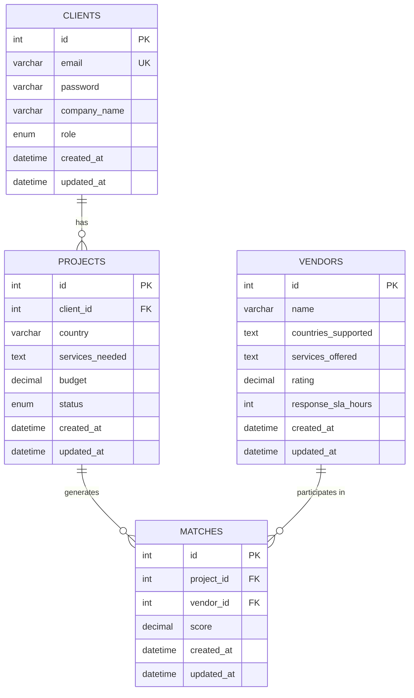
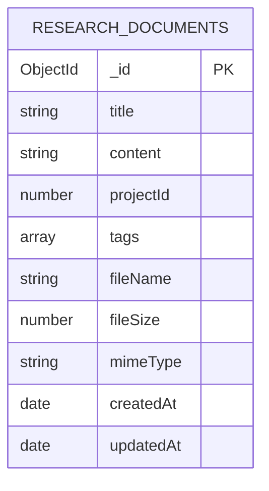

# 🚀 Expansion Management System

A comprehensive backend system for managing international expansion projects, vendor matching, and research document management.

## ✨ Features

- **🔐 Authentication & Authorization**: JWT-based auth with role-based access (client/admin)
- **📊 Project Management**: Create and manage expansion projects across countries
- **🏢 Vendor Management**: Admin-controlled vendor database with ratings and SLAs
- **🎯 Smart Matching**: AI-powered vendor-project matching algorithm
- **📄 Document Management**: Store and search research documents in MongoDB
- **📈 Analytics**: Cross-database insights combining MySQL and MongoDB data
- **📧 Notifications**: Email alerts for new matches and SLA violations
- **⏰ Scheduling**: Automated daily match refresh and SLA monitoring

## 🏗️ Architecture

### Database Schema

#### MySQL (Structured Data)


#### MongoDB (Unstructured Data)


## 🚀 Quick Start

### Prerequisites
- Node.js 18+
- Docker & Docker Compose
- MySQL 8.0+
- MongoDB 7.0+
- Redis 7.2+

### 1. Clone & Install
```bash
git clone <repository-url>
cd simple-expansion-mgmt-app
npm install
```

### 2. Environment Setup
```bash
cp .env.example .env
# Edit .env with your configuration
```

### 3. Start Services
```bash
# Start databases
docker compose up -d mysql mongodb redis

# Run migrations
npm run migration:run

# Seed databases
npm run seed:mysql
npm run seed:mongodb

# Start application
npm run start:dev
```

## 📊 Vendor Matching Formula

The system uses a sophisticated scoring algorithm to match vendors with projects:

```
Score = (Services Overlap × 2) + Vendor Rating + SLA Weight

Where:
- Services Overlap: Number of matching services between project and vendor
- Vendor Rating: Vendor's rating (0-5 scale)
- SLA Weight: 24 / response_sla_hours (lower SLA = higher weight)

Example:
- Project needs: ['legal_services', 'compliance']
- Vendor offers: ['legal_services', 'compliance', 'contract_negotiation']
- Services Overlap: 2
- Vendor Rating: 4.5
- SLA: 24 hours
- SLA Weight: 24/24 = 1.0

Final Score: (2 × 2) + 4.5 + 1.0 = 9.5
```

## 🔌 API Endpoints

### Authentication
```http
POST /api/v1/auth/login
```

### Projects
```http
GET    /api/v1/projects
POST   /api/v1/projects
GET    /api/v1/projects/:id
PUT    /api/v1/projects/:id
DELETE /api/v1/projects/:id
```

### Vendors (Admin Only)
```http
GET    /api/v1/vendors
POST   /api/v1/vendors
GET    /api/v1/vendors/:id
PUT    /api/v1/vendors/:id
DELETE /api/v1/vendors/:id
```

### Matches
```http
POST /api/v1/projects/:id/matches/rebuild
```

### Documents
```http
GET    /api/v1/documents
POST   /api/v1/documents
GET    /api/v1/documents/:id
PUT    /api/v1/documents/:id
DELETE /api/v1/documents/:id
GET    /api/v1/documents/search?q=query&tags=tag1,tag2
```

## 📝 Sample API Requests

### Login
```bash
curl -X POST http://localhost:3000/api/v1/auth/login \
  -H "Content-Type: application/json" \
  -d '{
    "email": "admin@expansionmgmt.com",
    "password": "password123"
  }'
```

### Create Project
```bash
curl -X POST http://localhost:3000/api/v1/projects \
  -H "Authorization: Bearer YOUR_JWT_TOKEN" \
  -H "Content-Type: application/json" \
  -d '{
    "country": "Germany",
    "services_needed": ["legal_services", "compliance"],
    "budget": 50000
  }'
```

### Rebuild Matches
```bash
curl -X POST http://localhost:3000/api/v1/projects/1/matches/rebuild \
  -H "Authorization: Bearer YOUR_JWT_TOKEN"
```

### Upload Document
```bash
curl -X POST http://localhost:3000/api/v1/documents \
  -H "Authorization: Bearer YOUR_JWT_TOKEN" \
  -F "file=@document.pdf" \
  -F "title=Market Analysis" \
  -F "tags=market,analysis,germany"
```

## 🗄️ Database Seeding

### MySQL Seeding
```bash
npm run seed:mysql
```

### MongoDB Seeding
```bash
npm run seed:mongodb
```

## 🐳 Docker Commands

```bash
# Start all services
docker compose up -d

# View logs
docker compose logs -f

# Stop services
docker compose down

# Rebuild and restart
docker compose up -d --build
```

## 📋 Sample User Credentials

### Admin User
- **Email**: `admin@expansionmgmt.com`
- **Password**: `password123`
- **Role**: Admin (full access)

### Client Users
- **Email**: `client1@example.com`
- **Password**: `password123`
- **Company**: Tech Startup Inc

- **Email**: `client2@example.com`
- **Password**: `password123`
- **Company**: Global Enterprises Ltd

## 🔧 Development Scripts

```bash
# Development
npm run start:dev          # Start with hot reload
npm run start:debug        # Start with debug mode

# Building
npm run build              # Build for production
npm run start:prod         # Start production build

# Database
npm run migration:generate  # Generate new migration
npm run migration:run      # Run pending migrations
npm run migration:revert   # Revert last migration

# Seeding
npm run seed:mysql         # Seed MySQL database
npm run seed:mongodb       # Seed MongoDB database

# Docker
npm run docker:up          # Start Docker services
npm run docker:down        # Stop Docker services
npm run docker:logs        # View Docker logs

# Testing
npm run test               # Run unit tests
npm run test:e2e           # Run end-to-end tests
npm run test:cov           # Run tests with coverage
```

## 🚀 Deployment

### Production Deployment
```bash
# Build production image
docker build -t expansion-mgmt:latest .

# Run with production environment
docker run -d \
  -p 3000:3000 \
  --env-file .env.production \
  expansion-mgmt:latest
```

### Deployment Links
- **Production**: https://expansion-mgmt.production.com (dummy link)
- **Staging**: https://expansion-mgmt.staging.com (dummy link)
- **Documentation**: https://docs.expansion-mgmt.com (dummy link)

### Environment Variables
```bash
# Database
DB_HOST=localhost
DB_PORT=3306
DB_USERNAME=root
DB_PASSWORD=password
DB_DATABASE=expansion_mgmt

# MongoDB
MONGODB_URI=mongodb://localhost:27017/expansion_mgmt

# JWT
JWT_SECRET=your-super-secret-jwt-key

# Email (Mailtrap)
EMAIL_HOST=smtp.mailtrap.io
EMAIL_PORT=2525
EMAIL_USER=your-email-user
EMAIL_PASS=your-email-password
EMAIL_FROM=noreply@expansionmgmt.com

# Redis
REDIS_HOST=localhost
REDIS_PORT=6379

# App
PORT=3000
NODE_ENV=development
```


## 🔒 Security Features

- JWT token authentication
- Role-based access control
- Password hashing with bcrypt
- Input validation and sanitization
- CORS configuration
- Rate limiting (configurable)

## 🧪 Testing

```bash
# Unit tests
npm run test

# E2E tests
npm run test:e2e

# Test coverage
npm run test:cov

# Test specific file
npm run test -- --testNamePattern="AuthService"
```

## 📚 API Documentation

Full API documentation is available at:
- **Swagger UI**: http://localhost:3000/api/docs
- **OpenAPI Spec**: http://localhost:3000/api-json

## 🤝 Contributing

1. Fork the repository
2. Create a feature branch (`git checkout -b feature/amazing-feature`)
3. Commit your changes (`git commit -m 'Add amazing feature'`)
4. Push to the branch (`git push origin feature/amazing-feature`)
5. Open a Pull Request

## 📄 License

This project is licensed under the MIT License - see the [LICENSE](LICENSE) file for details.

## 🆘 Support

- **Documentation**: [docs.expansion-mgmt.com](https://docs.expansion-mgmt.com)
- **Issues**: [GitHub Issues](https://github.com/your-org/expansion-mgmt/issues)
- **Email**: support@expansionmgmt.com


---

**Built with ❤️ using NestJS, TypeScript, MySQL, MongoDB, and Docker**
