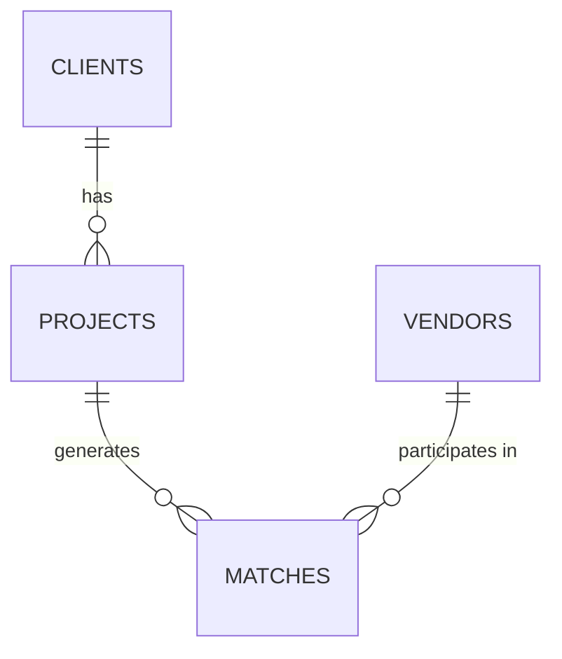

# Database Schema Documentation

## Overview

The Expansion Management System uses a hybrid database approach:
- **MySQL**: For structured, relational data (clients, projects, vendors, matches)
- **MongoDB**: For unstructured research documents and file metadata

## MySQL Schema

### Tables

#### 1. clients
| Column | Type | Constraints | Description |
|--------|------|-------------|-------------|
| id | INT | PRIMARY KEY, AUTO_INCREMENT | Unique client identifier |
| email | VARCHAR(255) | UNIQUE, NOT NULL | Client's email address |
| password | VARCHAR(255) | NOT NULL | Hashed password |
| company_name | VARCHAR(255) | NOT NULL | Company name |
| role | ENUM | NOT NULL, DEFAULT 'client' | User role (client/admin) |
| created_at | DATETIME(6) | NOT NULL, DEFAULT CURRENT_TIMESTAMP | Record creation time |
| updated_at | DATETIME(6) | NOT NULL, DEFAULT CURRENT_TIMESTAMP ON UPDATE | Record update time |

#### 2. vendors
| Column | Type | Constraints | Description |
|--------|------|-------------|-------------|
| id | INT | PRIMARY KEY, AUTO_INCREMENT | Unique vendor identifier |
| name | VARCHAR(255) | NOT NULL | Vendor company name |
| countries_supported | TEXT | NOT NULL | Comma-separated list of supported countries |
| services_offered | TEXT | NOT NULL | Comma-separated list of offered services |
| rating | DECIMAL(3,2) | NOT NULL, DEFAULT 0.00 | Vendor rating (0-5 scale) |
| response_sla_hours | INT | NOT NULL, DEFAULT 24 | Response time in hours |
| created_at | DATETIME(6) | NOT NULL, DEFAULT CURRENT_TIMESTAMP | Record creation time |
| updated_at | DATETIME(6) | NOT NULL, DEFAULT CURRENT_TIMESTAMP ON UPDATE | Record update time |

#### 3. projects
| Column | Type | Constraints | Description |
|--------|------|-------------|-------------|
| id | INT | PRIMARY KEY, AUTO_INCREMENT | Unique project identifier |
| client_id | INT | NOT NULL, FOREIGN KEY | Reference to clients table |
| country | VARCHAR(255) | NOT NULL | Target country for expansion |
| services_needed | TEXT | NOT NULL | Comma-separated list of required services |
| budget | DECIMAL(10,2) | NOT NULL | Project budget amount |
| status | ENUM | NOT NULL, DEFAULT 'draft' | Project status |
| created_at | DATETIME(6) | NOT NULL, DEFAULT CURRENT_TIMESTAMP | Record creation time |
| updated_at | DATETIME(6) | NOT NULL, DEFAULT CURRENT_TIMESTAMP ON UPDATE | Record update time |

**Project Status Values:**
- `draft`: Initial planning phase
- `active`: Currently being executed
- `completed`: Successfully finished
- `cancelled`: Project terminated

#### 4. matches
| Column | Type | Constraints | Description |
|--------|------|-------------|-------------|
| id | INT | PRIMARY KEY, AUTO_INCREMENT | Unique match identifier |
| project_id | INT | NOT NULL, FOREIGN KEY | Reference to projects table |
| vendor_id | INT | NOT NULL, FOREIGN KEY | Reference to vendors table |
| score | DECIMAL(5,2) | NOT NULL | Calculated match score |
| created_at | DATETIME(6) | NOT NULL, DEFAULT CURRENT_TIMESTAMP | Record creation time |
| updated_at | DATETIME(6) | NOT NULL, DEFAULT CURRENT_TIMESTAMP ON UPDATE | Record update time |

### Relationships

- **One-to-Many**: A client can have multiple projects
- **One-to-Many**: A project can generate multiple vendor matches
- **One-to-Many**: A vendor can participate in multiple matches

### Indexes

- **clients.email**: UNIQUE index for fast email lookups
- **projects.client_id**: Index for filtering projects by client
- **matches.project_id**: Index for finding matches by project
- **matches.vendor_id**: Index for finding matches by vendor
- **matches.project_id + vendor_id**: UNIQUE composite index to prevent duplicate matches

## MongoDB Schema

### Collections

#### researchdocuments

| Field | Type | Description |
|-------|------|-------------|
| _id | ObjectId | MongoDB document identifier |
| title | String | Document title |
| content | String | Document content or description |
| projectId | Number | Reference to MySQL project ID |
| tags | Array[String] | Array of searchable tags |
| fileName | String | Original filename |
| fileSize | Number | File size in bytes |
| mimeType | String | MIME type of the file |
| createdAt | Date | Document creation timestamp |
| updatedAt | Date | Document update timestamp |

### Indexes

- **projectId**: Index for filtering documents by project
- **tags**: Index for tag-based searches
- **title + content**: Text index for full-text search

## Data Types

### MySQL Data Types
- **VARCHAR**: Variable-length strings (max 255 chars)
- **TEXT**: Long text fields for arrays and descriptions
- **DECIMAL**: Fixed-point decimal numbers for financial data
- **INT**: Integer values for IDs and counts
- **ENUM**: Enumerated values for status fields
- **DATETIME**: Timestamp with microsecond precision

### MongoDB Data Types
- **String**: Text fields
- **Number**: Numeric values
- **Array**: Lists of values
- **Date**: Timestamp objects
- **ObjectId**: Unique document identifiers

## Constraints

### Foreign Key Constraints
- `projects.client_id` → `clients.id` (CASCADE DELETE)
- `matches.project_id` → `projects.id` (CASCADE DELETE)
- `matches.vendor_id` → `vendors.id` (CASCADE DELETE)

### Unique Constraints
- `clients.email`: Each email can only be used once
- `matches.project_id + vendor_id`: Each project-vendor combination can only have one match

### Default Values
- `clients.role`: Defaults to 'client'
- `vendors.rating`: Defaults to 0.00
- `vendors.response_sla_hours`: Defaults to 24
- `projects.status`: Defaults to 'draft'
- All timestamp fields: Default to current timestamp

## Performance Considerations

### MySQL
- Use appropriate indexes for frequently queried fields
- Consider partitioning for large tables
- Regular maintenance of indexes and statistics

### MongoDB
- Text indexes for search functionality
- Compound indexes for complex queries
- Regular index maintenance and optimization

## Backup Strategy

### MySQL
- Daily full backups
- Transaction log backups every hour
- Point-in-time recovery capability

### MongoDB
- Daily database dumps
- Oplog backups for incremental recovery
- Regular consistency checks
